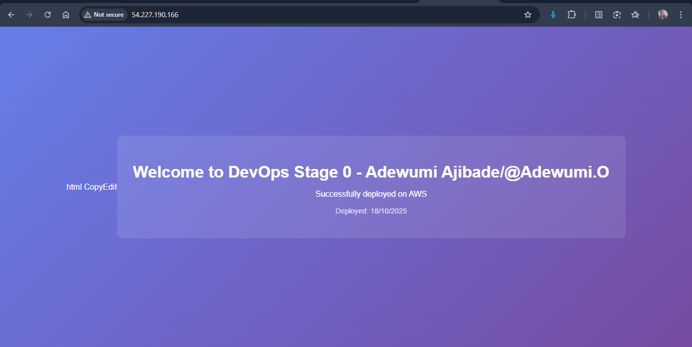

# HNG13 DevOps Stage 0

**Name:** Adewumi Ajibade  

**Slack Username:** @Adewumi.O 

**Project Description:**  
This repository contains my submission for the HNG13 DevOps Stage 0 task.  
It involves deploying a live NGINX web server and hosting a custom HTML page that is publicly accessible from the internet using AWS EC2.

The goal of this task was to:
- Set up and manage a GitHub workflow  
- Deploy and configure an NGINX server  
- Serve a custom webpage on port 80, accessible to the public 

- **Server IP:** [http://54.227.190.166/](http://54.227.190.166/)  

---

